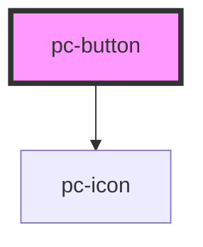

# pc-button

<!-- Auto Generated Below -->

## Properties

| Property    | Attribute    | Description | Type                                                   | Default     |
| ----------- | ------------ | ----------- | ------------------------------------------------------ | ----------- |
| `ariaLabel` | `aria-label` |             | `string`                                               | `undefined` |
| `disabled`  | `disabled`   |             | `boolean`                                              | `false`     |
| `icon`      | `icon`       |             | `string`                                               | `undefined` |
| `type`      | `type`       |             | `"button" \| "reset" \| "submit"`                      | `'button'`  |
| `variant`   | `variant`    |             | `"destructive" \| "ghost" \| "primary" \| "secondary"` | `'primary'` |

## Events

| Event         | Description | Type                |
| ------------- | ----------- | ------------------- |
| `buttonClick` |             | `CustomEvent<void>` |

## Dependencies

### Depends on

- [pc-icon](../pc-icon)

### Graph

----------------------------------------------

*Built with [StencilJS](https://stenciljs.com/)*
